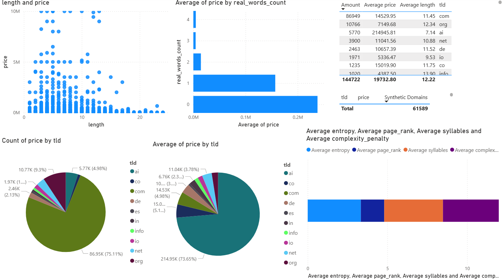
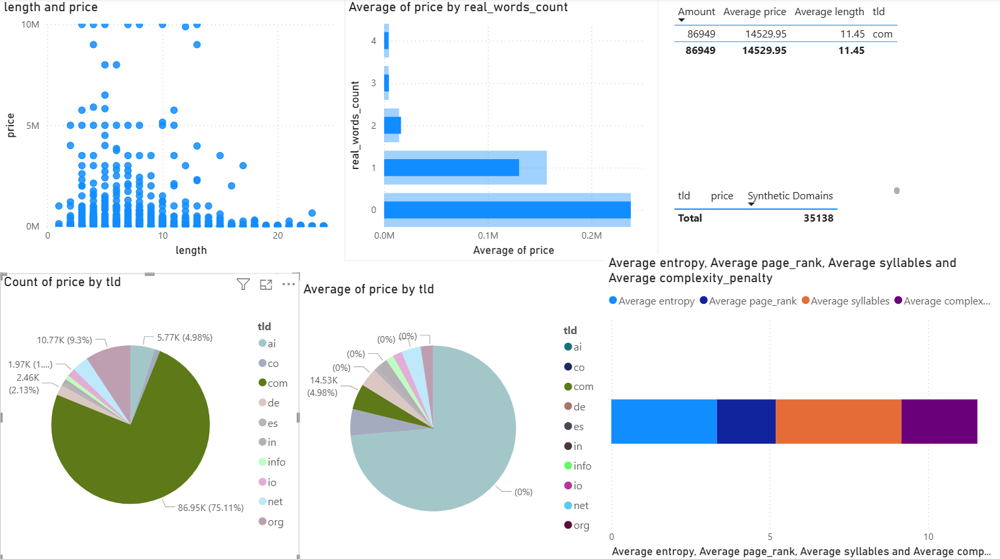
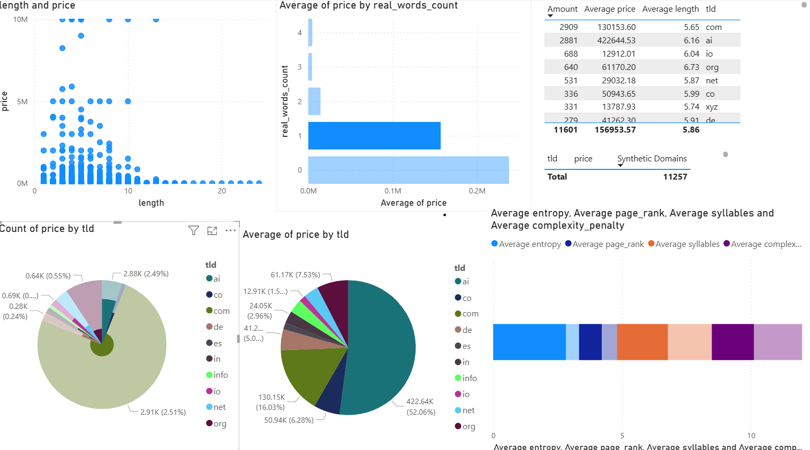

# Domain-Evaluator

Current error: 0.122 RMSLE (~13% error)

An end-to-end domain name appraisal system that predicts market values of domain names using historical sales data. The project integrates web scraping, machine learning, hyperparameter optimization, and interactive visualization.

**How It works:**
1. Domain Gathering: From multiple sources, including domain auction sites, public domain infomation is gathered.
2. Parsing: The domains are turned into a single uniform data type, and multiple features are extracted, including length, price, tld, enthopy, syllables, real words etc.
3. Modeling: Gathered features, real word embeddings, and an ngram of the domain are fed to a  XGBoost model, which is tuned with Optuna for the best validation error. This best model is then saved.

**Tech Stack**
1. Python for automation and data parsing
2. Pandas and Numpy for fast data parsing and manipulation
3. Beautiful Soup for gathering data
4. PowerBI and Mathplotlib for visualized insights
5. Hugging Face for sentence transformer and embeddings
6. XGBoost for gradient boosting modeling
7. Optuna for model optimization

   **Future Updates**
   Quantile Regression for better outcomes across different ranges of data
   Splitting into different models for different ranges of data
   Chatgpt integration for industry insights
   Integrating SEO infomation

