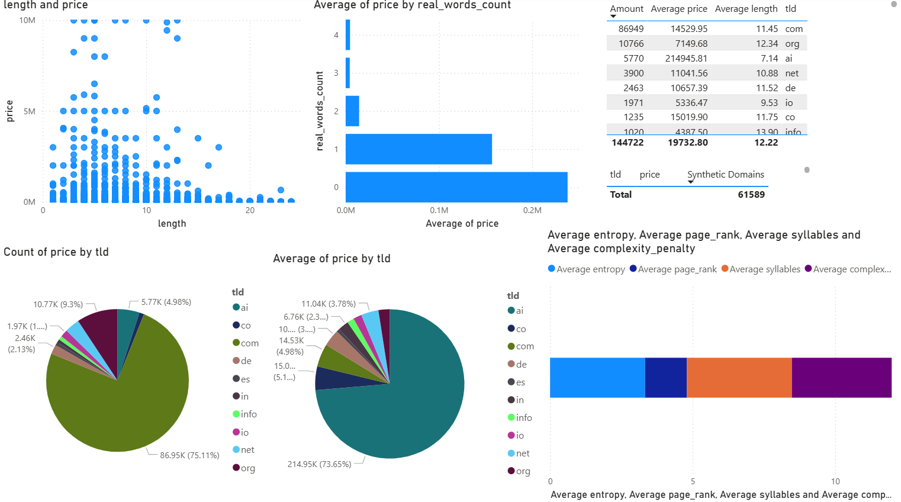

# Domain-Evaluator

Current error: .978 RMSE (0.122 RMSLE (~13% error) previously)

An end-to-end domain name appraisal system that predicts market values of domain names using historical sales data. The project integrates web scraping, machine learning, hyperparameter optimization, and interactive visualization.

**How It works:**
1. Domain Gathering: From multiple sources, including domain auction sites, public domain infomation is gathered (previously at ~150k domains, now at ~1.5 million, however aggressive sampling results in only 200k domains being used in training).
2. Parsing: The domains are turned into a single uniform data type, and multiple features are extracted, including length, price, tld, enthopy, syllables, real words etc.
3. Modeling: Gathered features, real word embeddings, and an ngram of the domain are fed to a 4 level ensemble model, which is tuned with Optuna for the best validation error. This best model is then saved.

**Tech Stack**
1. Python for automation and data parsing
2. Pandas and Numpy for fast data parsing and manipulation
3. LLM skills for workflows
4. Beautiful Soup for gathering data
5. PowerBI and Mathplotlib for visualized insights
6. Hugging Face for sentence transformer and embeddings
7. XGBoost for gradient boosting modeling
8. Optuna for model optimization

   **Future Updates**
    Gradually reduce reliance on LLM-derived features to improve efficiency and scalability
    Expand dataset coverage, particularly for rare or underrepresented gTLDs (e.g., .tech, .cloud)
    Continue refining segmentation strategies across different price ranges
    Explore additional lightweight signals to replace expensive feature sources

OLD DATA
 [October 2025]

(Last updated April 2026)

